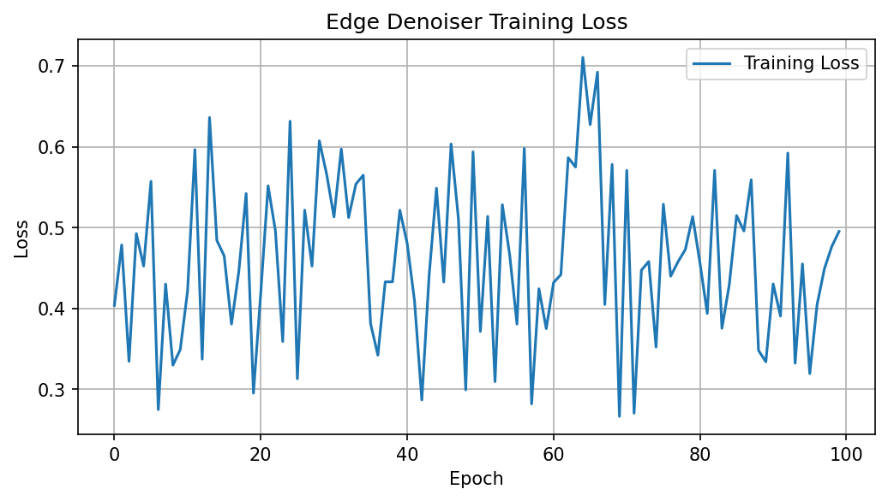

# DiffMS-Mini

DiffMS 论文（ICML 2025）的小规模复现项目。

目标：根据质谱图（MS/MS）生成候选分子结构，属于"由谱到结构"的逆向结构解析任务。

## 项目结构

```
DiffMS-Mini/
├── scripts/
│   ├── 04_graph_utils.py     # 分子图编解码（build_adj / adj_to_mol）
│   ├── 05_diffusion.py       # 离散扩散正向加噪
│   ├── 06_graph_decoder.py   # 边缘去噪 MLP 解码器
│   └── 07_train.py           # 训练脚本（加噪 → 训练 → 存模型 + loss曲线）
├── checkpoints/              # 训练好的模型参数
├── notebooks/
│   └── day6_test.ipynb       # Day6 单元测试
├── logs/                     # 每日学习日志
├── images/                   # 生成图片和训练曲线
└── README.md
```

## 已实现（第一周）

- [x] 分子图编解码管线（SMILES -> 邻接矩阵 one-hot 编码 -> 还原 RDKit Mol）
- [x] Morgan 指纹生成（2048 位，半径 2）
- [x] 离散扩散正向加噪过程（噪声调度 / q_sample / 随机时间步采样）
- [x] 边缘去噪 MLP 解码器（2073 维输入 -> 5 类键类型预测）
- [x] 编解码往返测试（build_adj -> adj_to_mol 完整验证）
- [x] 训练流程跑通（5 分子小样本，loss 从 1.6 降至 0.6）
- [x] 模型 checkpoint 保存与加载（支持断点续训）
- [x] Loss 曲线可视化

## 训练结果



在 5 个分子、100 轮训练下，loss 从 1.60 降至 0.60，模型能从噪声邻接矩阵中逐步恢复正确的键类型。

## 环境配置

```bash
pip install -r requirements.txt
```

## 论文来源

DiffMS: Diffusion Generation of Molecules Conditioned on Mass Spectra (ICML 2025)

## 学习日志

每日学习记录在 [logs/](./logs/) 目录，包含论文理解、代码实现、遇到的问题与解决方案。
