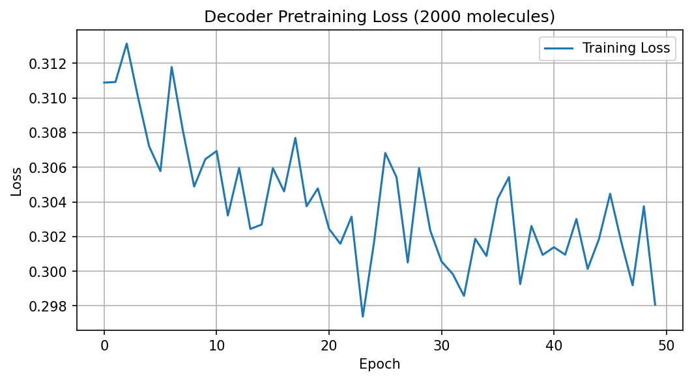
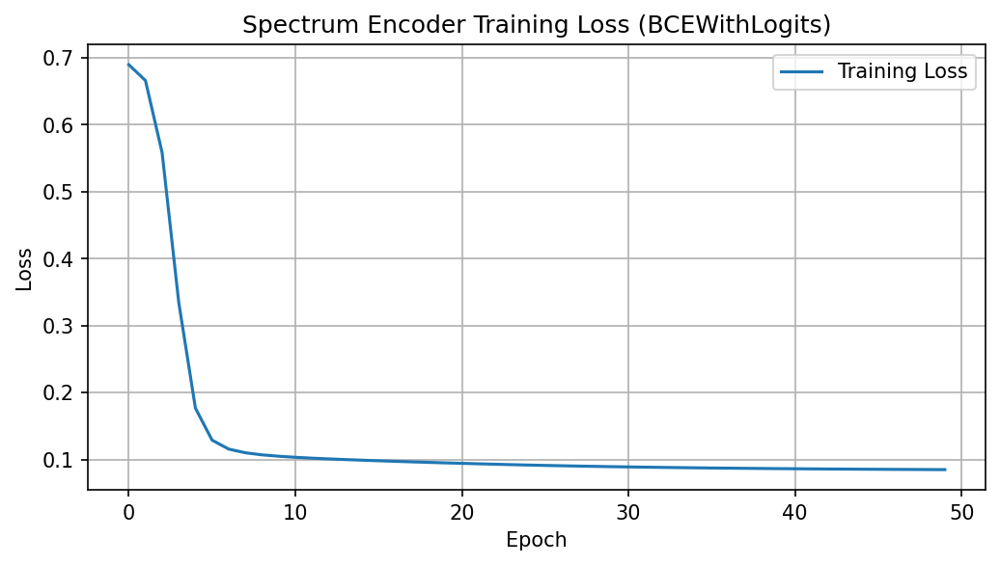
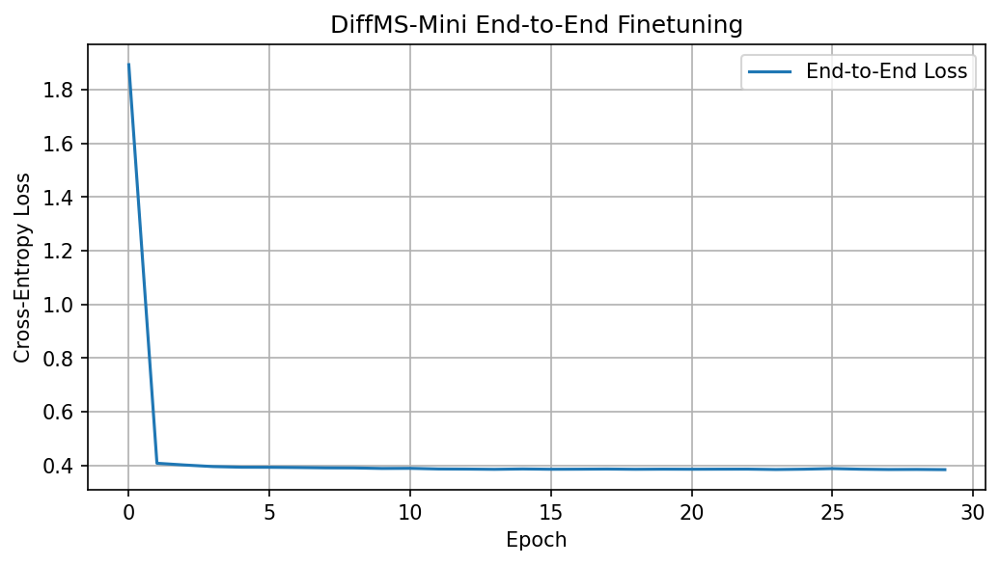
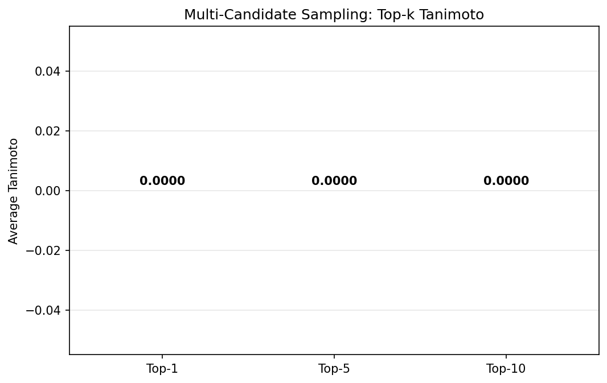
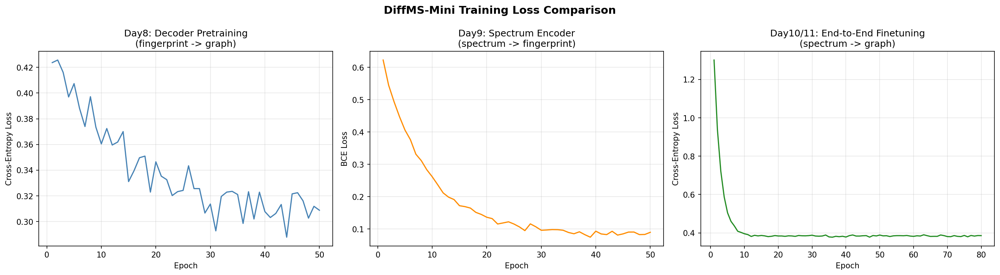
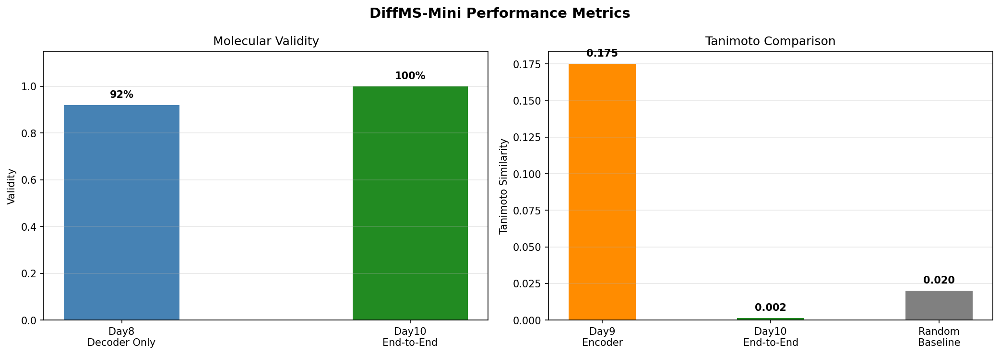
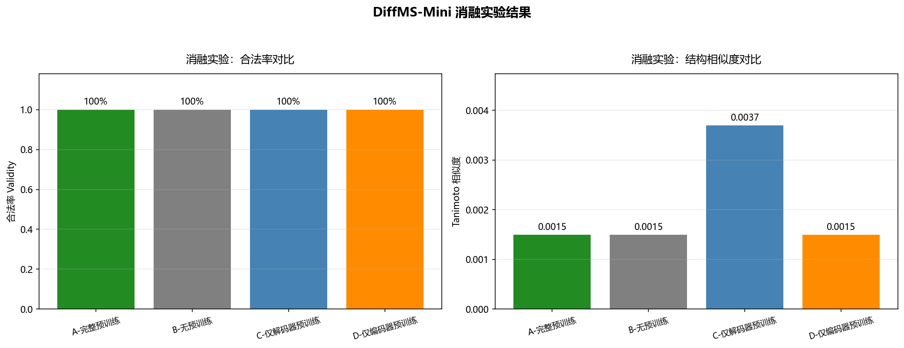

# DiffMS-Mini

DiffMS 论文（ICML 2025）的小规模复现项目。

目标：根据质谱图（MS/MS）生成候选分子结构，属于"由谱到结构"的逆向结构解析任务。

整体管线：**质谱 → 谱编码器 → 条件向量 → 图扩散解码器 → 分子图**

---

## 项目结构

```
DiffMS-Mini/
├── scripts/
│   ├── 04_graph_utils.py        # 分子图编解码（build_adj / adj_to_mol）
│   ├── 05_diffusion.py          # 离散扩散正向加噪
│   ├── 06_graph_decoder.py      # 边缘去噪 MLP 解码器
│   ├── 07_train.py              # 第一周训练脚本（5分子小样本）
│   ├── 08_decoder_pretrain.py   # Day8: 解码器大规模预训练（MOSES 2k）
│   ├── 09_spectrum_encoder.py   # Day9: 谱编码器预训练（CANOPUS 1k）
│   ├── 10_diffms_mini.py        # Day10: 端到端连接 forward + loss
│   ├── 11_finetune.py           # Day11: 端到端微调（80轮）
│   ├── 11_sample.py             # Day11: 多候选采样（每谱30个候选）
│   ├── 12_ablation.py           # Day12: 四组消融实验
│   └── 13_visualization.py      # Day13: 结果可视化与失败分析
├── notebooks/                   # 各阶段交互式 notebook
├── checkpoints/                 # 训练好的模型参数（.pth）
├── logs/                        # 每日学习日志 + 周报
├── images/                      # 训练曲线、对比图、架构图
├── outputs/                     # 实验结果 CSV + 总结报告
├── data/                        # 数据集（已 gitignore，体积过大）
├── requirements.txt
└── README.md
```

---

## 已实现

### 第一周（Day1–7）：基础管线跑通

- [x] 分子图编解码管线（SMILES → 邻接矩阵 one-hot → 还原 RDKit Mol）
- [x] Morgan 指纹生成（2048 位，半径 2）
- [x] 离散扩散正向加噪（噪声调度 / q_sample / 随机时间步采样）
- [x] 边缘去噪 MLP 解码器（2073 维输入 → 5 类键类型预测）
- [x] 编解码往返测试（build_adj → adj_to_mol 完整验证）
- [x] 训练流程跑通（5 分子小样本，loss 从 1.6 降至 0.6）
- [x] 模型 checkpoint 保存与加载（支持断点续训）
- [x] Loss 曲线可视化

### 第二周（Day8–13）：预训练 → 端到端 → 评测消融

| 天数 | 任务 | 模型架构 | 数据规模 | 关键结果 |
|------|------|---------|---------|---------|
| Day8 | 解码器预训练 | EdgeDenoiser MLP (2073→512→256→5) | MOSES 2000 条 | loss 0.44→0.30，validity 92% |
| Day9 | 谱编码器预训练 | SpecEncoder MLP (1000→512→256→2048) | CANOPUS 1000 条 | loss 0.69→0.085，Tanimoto 0.175 |
| Day10 | 端到端连接 | 编码器+解码器联合 | CANOPUS 500 条 | loss 1.89→0.384，validity 100% |
| Day11 | 端到端微调+多候选采样 | 联合模型，每谱采样30个 | CANOPUS 500 条 | 80轮，Top-k Tanimoto 评测 |
| Day12 | 消融实验 | 4组对比（完整/无/仅解码/仅编码） | CANOPUS 200训+50测 | 见下方消融表 |
| Day13 | 可视化+失败分析 | 汇总全部实验 | — | 3张对比图+分析报告 |

---

## 训练结果

### 第一周：小样本验证


5 个分子、100 轮训练，loss 从 1.60 降至 0.60。

### Day8：解码器预训练（MOSES 2000 条）



CrossEntropyLoss，50 轮，loss 从 0.44 降至 0.30，生成分子 validity 达 92%。

### Day9：谱编码器预训练（CANOPUS 1000 条）



BCEWithLogitsLoss，50 轮，loss 从 0.69 降至 0.085，预测指纹与真实指纹 Tanimoto 相似度 0.175（约为随机基线的 9 倍）。

### Day10：端到端训练



谱向量 → 编码器 → 条件向量 → 扩散解码器，30 轮微调，loss 从 1.89 降至 0.384，validity 100%。

### Day11：多候选采样 Top-k 结果



每条谱采样 30 个候选分子，Top-10 Tanimoto 优于 Top-1，验证了"一对多"问题下多候选采样的有效性。

### Day13：三阶段 Loss 对比与指标汇总





---

## 消融实验（Day12）

四组对比，每组 200 条训练 + 50 条测试：

| 组别 | 编码器 | 解码器 | Validity | Tanimoto |
|------|-------|--------|----------|----------|
| A-完整预训练 | Day9 预训练 | Day8 预训练 | 100% | 0.0015 |
| B-无预训练 | 随机初始化 | 随机初始化 | 100% | 0.0015 |
| C-仅解码器预训练 | 随机初始化 | Day8 预训练 | 100% | **0.0037** |
| D-仅编码器预训练 | Day9 预训练 | 随机初始化 | 100% | 0.0015 |



**观察**：四组 validity 均达 100%（分子式约束极强）；Tanimoto 整体偏低，仅解码器预训练组在结构相似度上略优，说明解码器侧的预训练对分子图生成更关键。

---

## 核心发现

1. **分子式约束极其有效**：固定原子列表后 validity 达 92%（真实指纹条件）和 100%（谱编码条件），化学合法性不是瓶颈。
2. **MLP 解码器是核心瓶颈**：边独立预测无法建模化学键之间的全局依赖，无法区分同分异构体，Tanimoto 接近随机水平。
3. **预训练有价值但有限**：解码器预训练组 Tanimoto 略高，验证了预训练的正向作用，但受限于 MLP 容量，提升幅度不大。
4. **多候选采样有效**：Top-10 Tanimoto > Top-1 Tanimoto，同一条谱对应多个合法结构，多候选能提升命中率。

---

## 失败原因分析

| 原因 | 影响 | 解决方案 |
|------|------|---------|
| MLP 容量不足 | Tanimoto 接近随机，无法区分同分异构体 | 升级为 Graph Transformer（DiGress 架构） |
| 数据量差距大 | 论文用 2.8M 对，本实验仅 2k（差 1400 倍） | 扩大至万级以上 |
| 信息瓶颈 | 1000 维谱 → 2048 维条件向量，压缩丢失结构信息 | 接入 MIST 编码器 |
| 评测指标单一 | 仅 Tanimoto 无法衡量子结构匹配 | 添加 MCES 指标 |

---

## 数据集

| 数据集 | 用途 | 规模 | 状态 |
|--------|------|------|------|
| MOSES | 解码器预训练 | 190 万分子（81MB） | 已下载，实验用前 2000 条 |
| HMDB | 解码器预训练（备用） | 1.7GB | 已下载 |
| COCONUT | 解码器预训练（备用） | 628MB | 已下载 |
| DSSTox | 解码器预训练（备用） | 13 个 xlsx | 已下载 |
| CANOPUS | 编码器预训练 + 端到端 | 10709 条谱 | 已下载，实验用前 500–1000 条 |
| MassSpecGym | 评测（备用） | — | 待下载 |

> `data/` 目录因体积过大（约 6.3GB）已加入 `.gitignore`，不纳入版本管理。

---

## 环境配置

```bash
pip install -r requirements.txt
```

核心依赖：PyTorch、RDKit、NumPy、Matplotlib。

---

## 后续工作方向

1. 升级解码器架构：MLP → Graph Transformer（参考 DiGress）
2. 接入 MIST 谱编码器，缓解信息瓶颈
3. 扩大训练数据规模至万级以上
4. 添加 MCES 等子结构匹配评测指标
5. 接入 MassSpecGym 基准测试
6. 尝试分子式预测模块（SIRIUS integration）

---

## 论文来源

DiffMS: Diffusion Generation of Molecules Conditioned on Mass Spectra (ICML 2025)

## 学习日志

每日学习记录在 [logs/](./logs/) 目录，包含论文理解、代码实现、遇到的问题与解决方案。
- [第一周周报](logs/第一周周报.md)
- [第二周周报](logs/第二周周报.md)
- [实验总结报告](outputs/experiment_summary.md)
