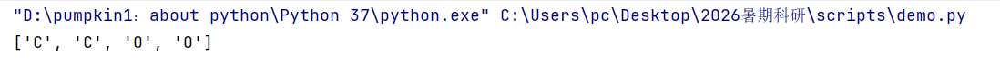
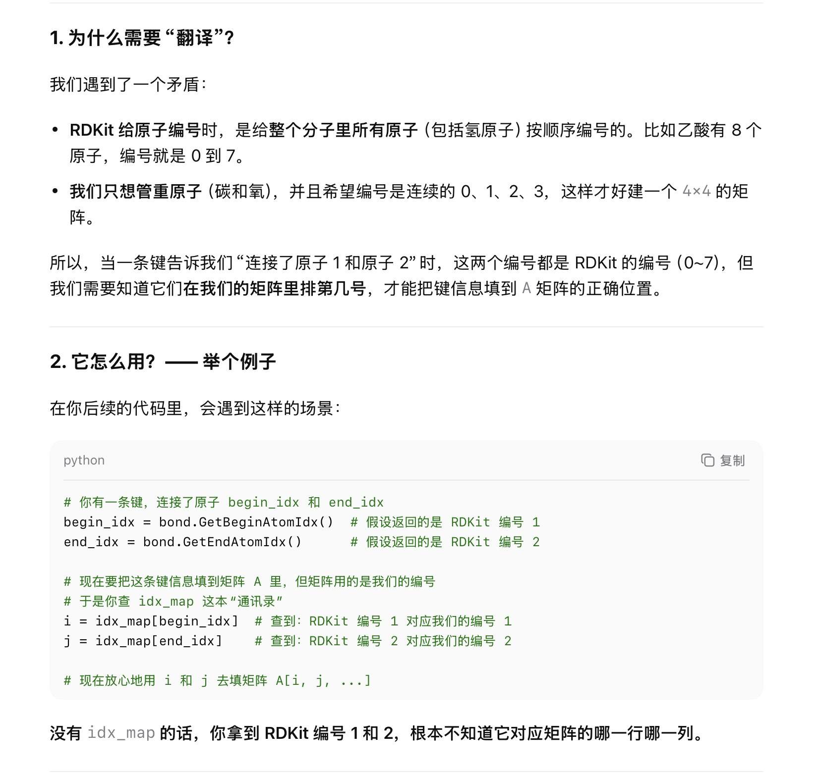
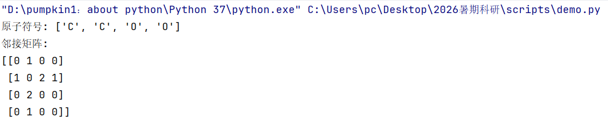
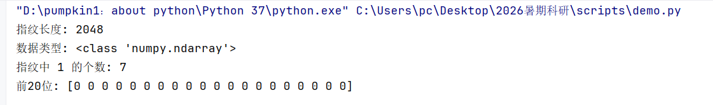
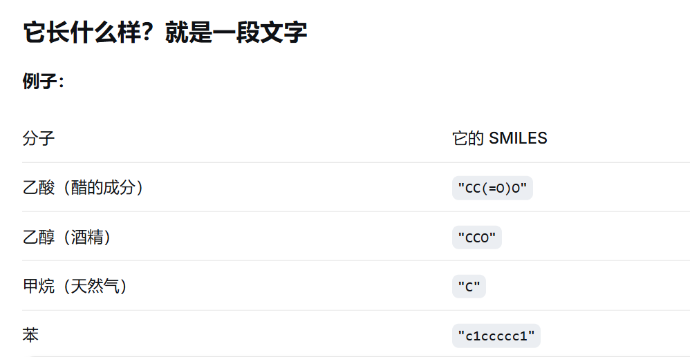
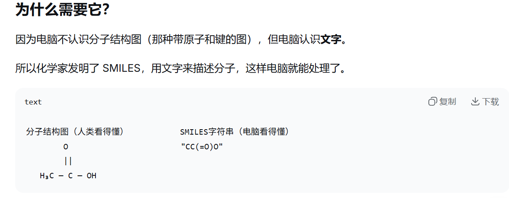
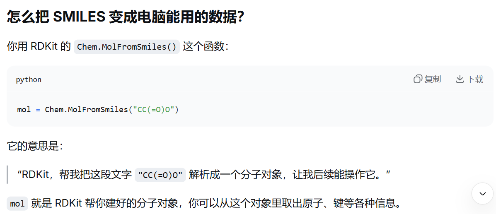
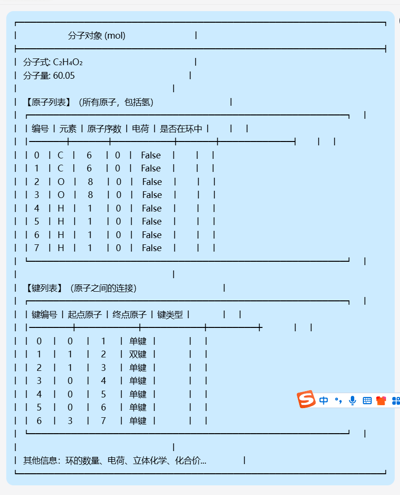
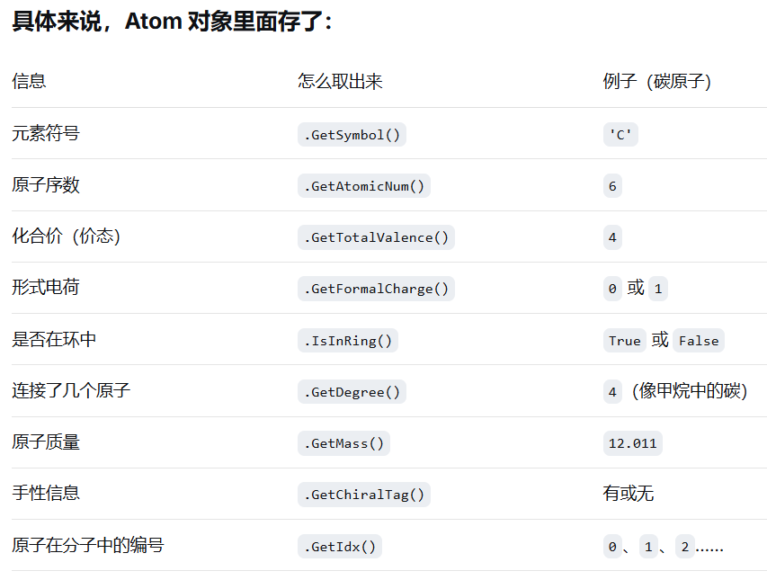

# DAY2日志
## 今日任务
    -[√]建立项目的仓库结构
    -[√]创建README.md和requirements.txt
    -[√]完成RDKit分子处理数据
        -[√]原子列表
        -[√]邻接矩阵
        -[√]分子指纹

## 遇到的问题
    1.在markdown文件里面插入图片要顶格写；../是在相对路径里面返回上一级目录
    2.返回原子列表函数里面，atom不能直接appendlist后面，因为atom对象里面存储的不是原子符号，是包含了原子信息的一系列内容
## 今日完成
### 1.提取原子列表(get_atom_list(mol))
    输入一个分子对象输出所有的原子符号；
    1. mol.GetAtoms()
        作用：把一个分子里的所有原子取出来
        返回：一个“原子列表”，里面包含分子中的每一个原子(atom对象)
        可以理解为：从分子里“拿出来”一个装着所有原子的集合，然后可以一个一个看每一个原子
    2. atom.GetAtomicNum()
        作用：获取某个原子的原子序数（也就是它在元素周期表里的编号）
        常见原子序数：
        氢 = 1
        碳 = 6
        氮 = 7
        氧 = 8
        可以理解为：问这个原子是几号元素
        为什么用这个：要筛选重原子（非氢原子）。氢的原子序数是 1，所以只要原子序数 > 1，就说明它不是氢。
    3. atom.GetSymbol()
        作用：获取原子的元素符号（也就是它的“名字”）
        返回值：'C'、'N'、'O'、'S' 等
        可以理解为：问这个原子化学符号表示

### 2.构建邻接矩阵(build_adj(mol))
    邻接矩阵里面的五个状态分别用来反映每个分子里面各个键的状态情况
    论文里面默认的是五个状态：无键，单键，双键，三键，芳香键
    邻接矩阵的行数和列数是重原子数，每个位置存储一个列表，用0和1来表示原子之间键的关系
    1.atom.GetIdx()
    这一部分的详细介绍用法思路见pdf文档整理
    2.heavy_atoms = [atom for atom in mol.GetAtoms() if atom.GetAtomicNum() > 1]
    记住这个写法，更简洁
    3.enumerate(list)函数
    有时候遍历一个列表，不仅需要知道元素是什么，还需要知道它是第几个元素
    它的返回值是一个配对，(序号，元素)。
    有两种常见的使用方法
    eg1:list=["苹果","香蕉","橘子"]
        for i in range(len(list)):
            print(f"第{i+1}个是{list[i]}")
    eg2:for i,fruit in enumerate(list):
            print(f"第{i+1}个是{fruit}")
    这一步是给所有的重原子重新编号，去掉氢原子

    4.np.zeros(..)
    专门用来创建全零数组
    5.mol.GetBonds()
    这是RDKit分子对象的内置方法，返回一个包含所有键的列表

### 3.生成分子指纹(get_fingerprint(mol))
    指纹有自带函数生成，但是需要自己把它转成0/1数组

## 额外的知识补充
### 1.RDKit
    （1）在 Python里可以通过 import rdkit 来使用；
    （2）包含大量化学数据处理功能的完整框架；
    （3）最核心的功能就包括：
        读取和写入分子：从 SMILES 字符串、SDF 文件等格式创建分子对象 
        生成分子指纹：例如你稍后会用到的 Morgan 指纹（用于分子相似性比较）
        计算分子描述符：如分子式、分子量、LogP 等 
        进行子结构搜索和匹配
        2D 和 3D 分子坐标生成与渲染
### 2.SMILES
    SMILES 不是数据结构，而是一个“字符串格式标准”。
    不同的软件和编程语言都认识它，但你需要用化学工具包（如 RDKit）把它“翻译”成计算机能用的分子对象（Mol 对象）

### 3.mol
    mol是一个变量名，存储的是RDKit的分子对象即Mol对象

### 4.atom

