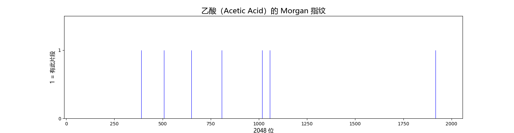

# DAY3_log:2026-7-10

## 今日目标
    -[*]理解Morgan指纹的生成原理
    -[*]理解“半径”在指纹生成中的作用
    -[*]理解为什么指纹数据比质谱数据多得多
    -[*]理解解码器训练的输入输出

## 核心问题记录
### 1.Morgan指纹的生成原理
    以分子中的每一个重原子为圆心，以2为半径，依次将圆心和小于等于半径范围内重原子做一个哈希映射，
    得到的映射值对应的数组索引位置记为1.
### 2.生成过程
    （1）以分子中的重原子为核心，以半径2开始框定范围画圈
    eg:       O
              ||
        H₃C — C — O — H
    第一个C,半径0只能看到自己[C];
    半径为1,[C1,C2];
    半径为2,[C1,C2,O1,O2];
    （2）记录所有的片段，一个片段就是不同的原子之间的键以及键的类型和连接方式；
    （3）用哈希算法转换成一个固定的数字编号；
    （4）在2048位数组中找到该位置并标记为1。
### 3.半径的衡量标准
    半径是怎么算的？单键双键和三键在算半径的时候有区别吗？
    半径数是化学键的根数，不看键的类型。键的类型会被记录在“结构片段”中，影响的是哈希值但是不影响半径的计算。
### 4.芳香键怎么处理？
    芳香键在计算半径的时候和双键单键一样，一根等于一步。
    eg:苯环里相邻两个碳 半径为1
       隔一个碳的碳原子（经过两根键） 半径为2
       对位的碳原子 半径为3
### 5.半径起到的作用
    半径决定了每个原子能看多远。半径越大，看到的原子和键越多，生成的片段也越丰富。半径2是论文选的标准值。
### 6.为什么指纹数据比质谱数据多得多？
    因为指纹数据是计算出来的，只要有分子结构就可以计算出来。而质谱数据是通过做实验得到的。
### 7.解码器预训练的输入和输出是什么？
    解码器预训练的任务是：输入分子指纹，输出分子结构。
### 8.一个分子只能生成一个指纹，但是分子的数量是庞大的，所以分子指纹数据的总量是非常庞大的。

## 可视化记录
